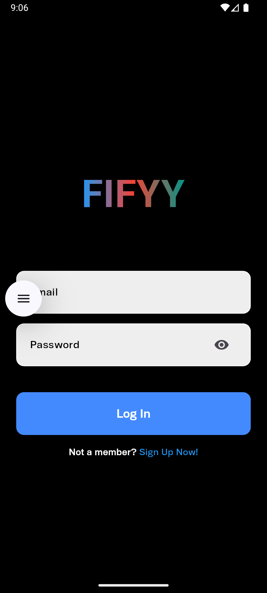
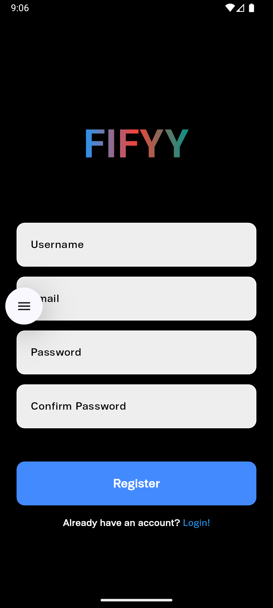
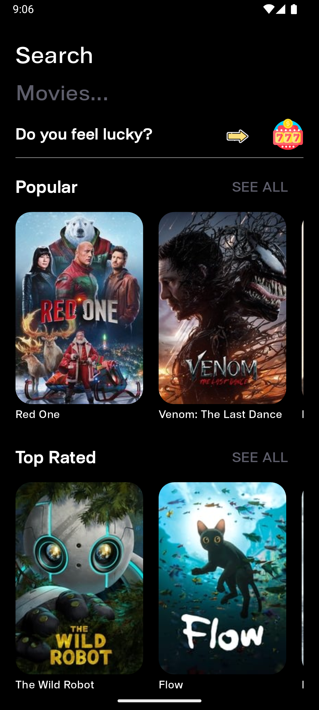
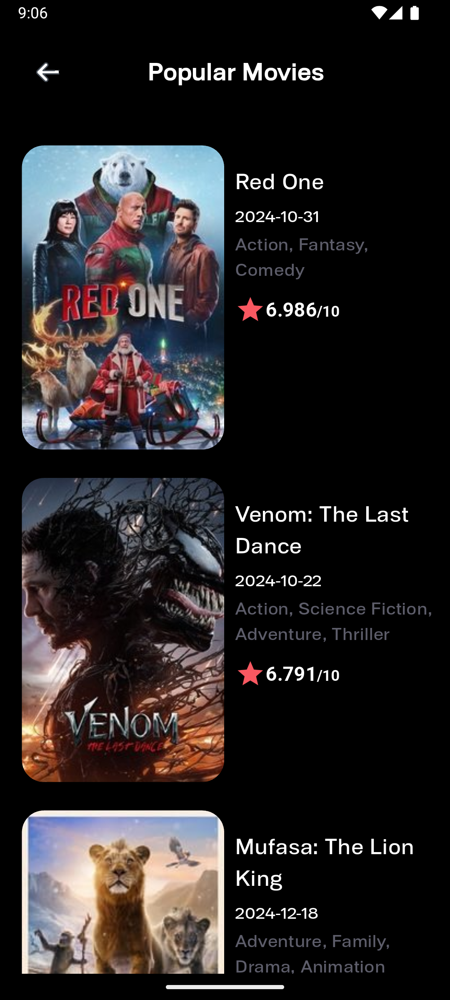
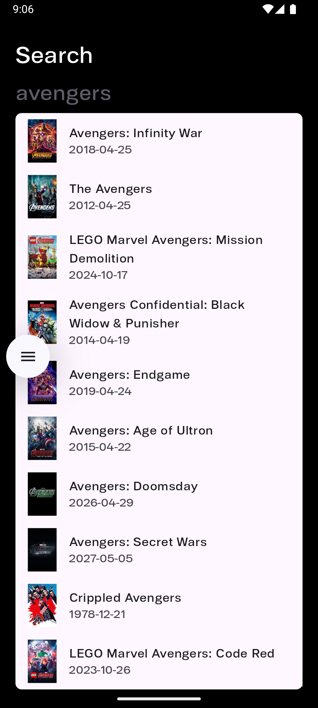
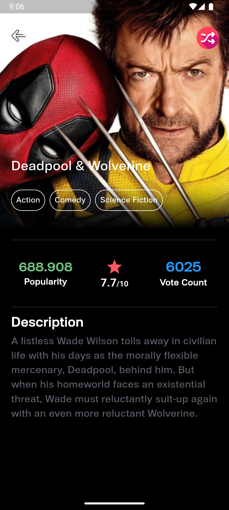

Fifyy - Film Keşif Uygulaması

Fifyy, kullanıcılara güncel film bilgileri sunan, kullanıcı dostu bir film keşif platformudur. Flutter framework’ü kullanılarak geliştirilen bu uygulama, güçlü ve modern bir kullanıcı arayüzü ile farklı türde film listeleri ve detayları sunmayı hedeflemiştir. Uygulama, SQLite ve TMDB (The Movie Database) API entegrasyonu ile desteklenmiştir.
Teknik Yapı
1. Kullanıcı Yönetimi

    Giriş ve Kayıt Ol:
        Kullanıcılar, SQLite tabanlı bir sistem aracılığıyla uygulamaya kayıt olabilir ve giriş yapabilir.
        SQLite kullanımı, uygulamanın offline modda bile temel kullanıcı yönetimini desteklemesini sağlamaktadır.

2. TMDB API Entegrasyonu

    TMDB API:
        TMDB API, popüler, en yüksek puanlı, yakında çıkacak (upcoming) ve şu anda vizyonda olan (now playing) filmler gibi çeşitli kategorilerdeki içerikleri uygulamaya entegre etmek için kullanılmıştır.
        API sayesinde kullanıcılar, filmler hakkında detaylı bilgiye kolayca ulaşabilmekte; filmin popülerliği, oy sayısı ve ortalama puanı gibi verileri görüntüleyebilmektedir.

3. Uygulama Özellikleri
Ana Sayfa

    Kullanıcı giriş yaptıktan sonra, ana sayfada farklı kategorilerdeki filmler listelenmektedir:
        Popular: En popüler filmler.
        Top Rated: En yüksek oy alan filmler.
        Upcoming: Yakında çıkacak filmler.
        Now Playing: Şu anda vizyonda olan filmler.

Arama Fonksiyonu

    Kullanıcılar, belirli bir filmi arama özelliği ile hızlı bir şekilde bulabilir.

Rastgele Film Tavsiyesi

    Rastgele Film Ver özelliği, kararsız kullanıcılar için öneriler sunarak izleme deneyimini kolaylaştırır.

Film Detayları

    Kullanıcı, herhangi bir filme tıkladığında filmin detaylarını görüntüleyebilir. Detaylar arasında:
        Popülerlik (Popularity)
        Oy Sayısı (Vote Count)
        Ortalama Puan (Vote Average)
    Filmin ortalama puanı, 10 üzerinden bir değerlendirme ile sunulmaktadır.

Kurulum
Gerekli Araçlar

    Flutter SDK
    SQLite veritabanı
    TMDB API Anahtarı

Adımlar

    Bu proje için gerekli olan bağımlılıkları yüklemek için aşağıdaki komutu çalıştırın:

flutter pub get

TMDB API anahtarını temin edin ve uygulamanın api_config.dart dosyasına ekleyin.
Uygulamayı başlatmak için:

    flutter run

Kullanıcı Arayüzü

Uygulama, modern bir kullanıcı arayüzüne sahiptir ve kullanıcı deneyimi göz önünde bulundurularak tasarlanmıştır. Ana sayfa, film kategorileri ve arama özellikleri kolayca erişilebilecek şekilde düzenlenmiştir. Ayrıca, mobil uyumluluk sayesinde farklı ekran boyutlarında da kullanıcı dostu bir deneyim sunmaktadır.

## Kullanıcı Arayüzü Görselleri

Splash Screen

Login Screen

Register Screen

Home Screen

Movie Detail Screen

Search Screen

Lucky Screen

